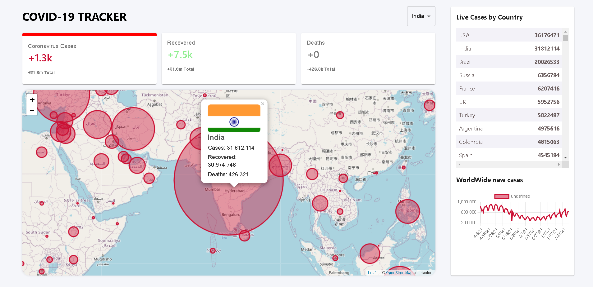

# Covid 19 Tracker App

>This Project is a beginner friendly project I built using ReactJs. 

### Some key Features:
- Shows Live Cases, Recoveries, Deaths (clickable tabs).
- Shows Worldwide cases and Country Based cases.
- Line Chart shows fluctuations over days.
- Clickable Markers on Map show Country stats.

Deployed live at https://covid-19-tracker-702ef.web.app/ Check out!

